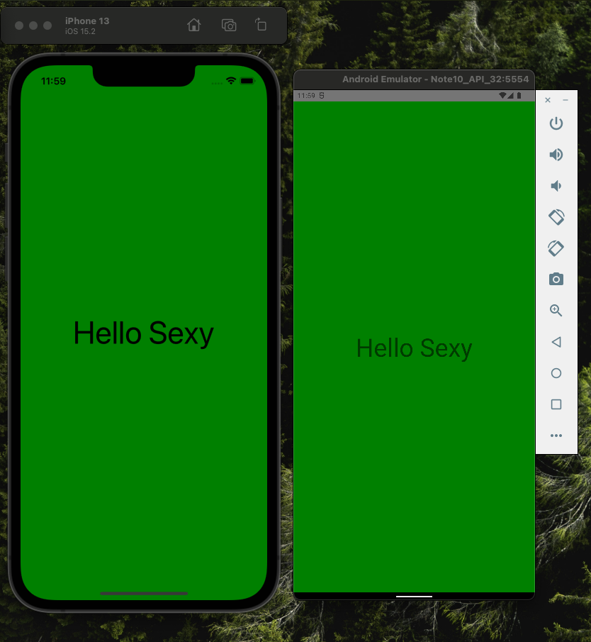

# Counter App - React Native

# Different ways to styled components

## 1. Inline style

```js
import React from 'react';
import {Text, View} from 'react-native';

const App = () => {
  return (
    <View
      style={{
        flex: 1,
        backgroundColor: 'green',
        justifyContent: 'center',
      }}>
      <Text
        style={{
          fontSize: 50,
          textAlign: 'center',
        }}>
        Hello Sexy
      </Text>
    </View>
  );
};

export default App;
```

<details >
<summary>Check result in iOS & Android</summary>



</details>

## 2.
