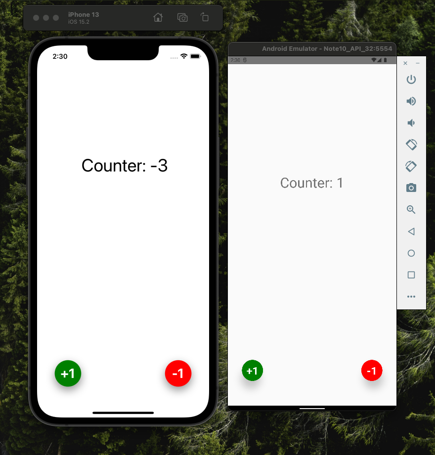
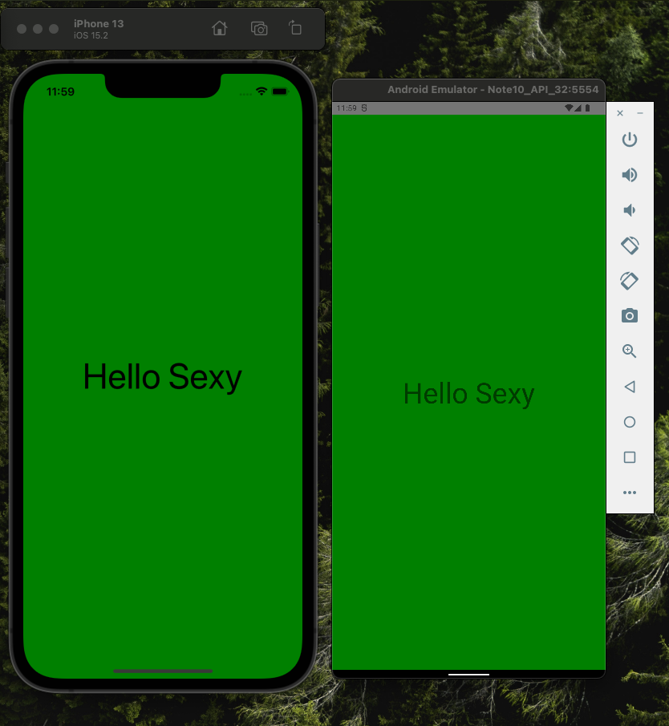

# Counter App - React Native

This project is a Counter App and you can do:

- Add one
- Subtract one
- See realtime counter

## Makers

- Developed by Jorge Arias Argüelles [GitHub](https://github.com/jorgearguellles) &
  [LinkedIn](https://www.linkedin.com/in/jorgeariasarguelles/)
- React Native: Aplicaciones nativas para IOS y Android course by Fernando Herrera [GitHub](https://github.com/Klerith) & [Udemy](https://globant.udemy.com/course/react-native-fh/)

## Development Technologies

Made with :green_heart: using:

- [React Native](https://reactnative.dev/docs/style)

## Screenshot App



## Feedback

Open to: [@JorgeAriasArgüelles](https://www.linkedin.com/in/jorgeariasarguelles/)

<br />
<br />
<br />
<br />
<hr />

## Create a React native App with TypeScript command line

- `npx react-native init NameTSProject --template react-native-template-typescript`

# Different ways to style components

## 1. Inline style

```js
import React from 'react';
import {Text, View} from 'react-native';

const App = () => {
  return (
    <View
      style={{
        flex: 1,
        backgroundColor: 'green',
        justifyContent: 'center',
      }}>
      <Text
        style={{
          fontSize: 50,
          textAlign: 'center',
        }}>
        Hello Sexy
      </Text>
    </View>
  );
};

export default App;
```

<details >
<summary>Check result in iOS & Android</summary>



</details>

## 2. Using the styles object

```js
import React, {useState} from 'react';
import {StyleSheet, Text, View} from 'react-native';
import {Fab} from '../components/Fab';

export const CounterScreen = () => {
  const [counter, setCounter] = useState(0);

  return (
    <View style={styles.container}>
      <Text style={styles.title}> Counter: {counter} </Text>
      <Fab
        title="-1"
        position="bottomRight"
        onPress={() => setCounter(counter - 1)}
        colorBtn="subtract"
      />
      <Fab
        title="+1"
        position="bottomLeft"
        onPress={() => setCounter(counter + 1)}
      />
    </View>
  );
};

const styles = StyleSheet.create({
  container: {
    flex: 1, // Means encompass all view that Dad container allows us
    justifyContent: 'center',
  },
  title: {
    fontSize: 40,
    top: -150,
    textAlign: 'center',
  },
});
```

#
